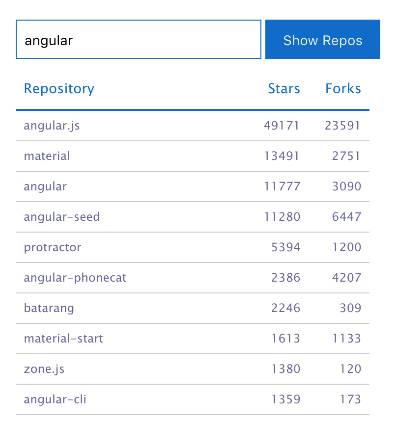

# Github Viewer

The goal of this project is to demonstrate key concepts of various front-end frameworks and libraries. We use a simple app called *Github Viewer* for this purpose. The app allows you to enter the name of an organization and displays its repositories, sorted by their star rating. Here's a screen shot of the application.

The various implementations, including the key concepts they demonstrate, are described below:

## github-viewer-ng2-basic
- Uses Angular2
- Demostrates how the `Http` class can be used to send HTTP requests and receive results in an `Observable`. See `github.service.ts` for the specific example.
- Shows how to pass data from a parent component to a child component using input bindings (the `@Input` decorator). The key pattern we are demonstrating here is called [Presentational and Container Components](https://medium.com/@dan_abramov/smart-and-dumb-components-7ca2f9a7c7d0#.y8en6d1u4). See `org-viewer.component.html` and `repo-list.component.ts` for the specifics.

## github-viewer-ng2-redux
- Uses Angular2 + [ng2-redux](https://github.com/angular-redux/ng2-redux) to demonstrate the one-way data flow pattern popularized by [React](https://facebook.github.io/react/) and [Redux](http://redux.js.org/).
